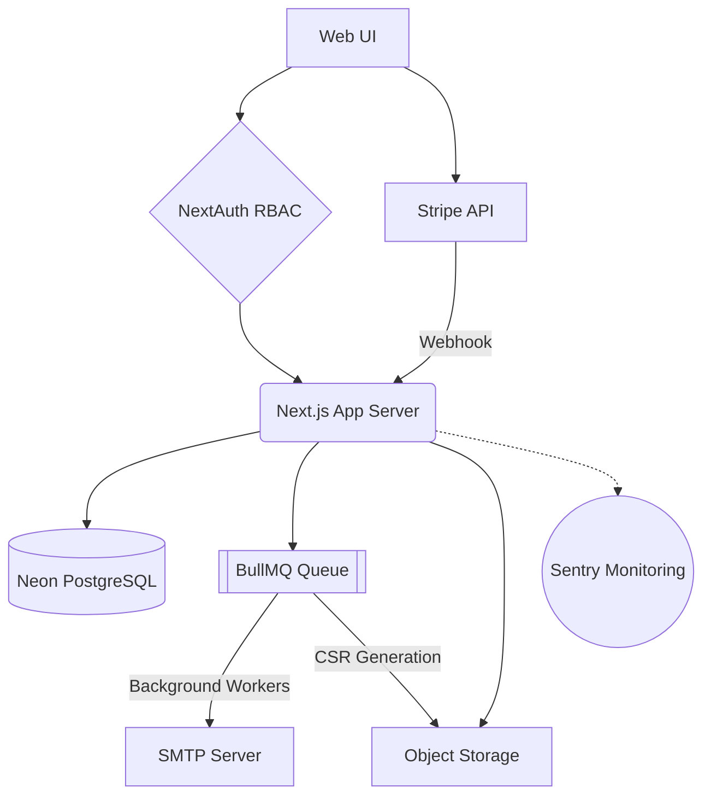

# System Architecture & Ownership

## 1. System Ownership Declaration

This platform is currently operated under stringent NGO governance. Technical maintenance responsibilities are explicitly assigned to prevent unassigned operational risk:

*   **Primary System Administrator:** [Insert Name/Role, e.g., Lead Developer]
*   **Secondary Escalation Contact:** [Insert Name/Role, e.g., Operations Manager]
*   **Hosting Account Owner:** [Insert Name/Role, e.g., NGO Director]

**Any transition of these roles must be contemporaneously updated in this document.**

---

## 2. Platform Architecture Layers

The platform leverages a decoupled, horizontally scalable infrastructure optimized for Financial Ledger Isolation and Event-Driven Safeguarding.

### App Layer (Vercel / Next.js)
*   **Framework:** Next.js (App Router)
*   **Runtime:** Serverless Functions (API Routes) and Edge Execution (Middleware)
*   **Authentication:** NextAuth.js (Session-based RBAC)

### Database Layer (Neon / PostgreSQL)
*   **ORM:** Prisma Client
*   **Role:** Single source of truth for Financial Ledgers, Sponsorship Allocations, and Core Identity.

### Asynchronous Queue Layer (Redis / BullMQ)
*   **Platform:** Upstash / Dedicated Redis Hosted
*   **Role:** Durable background processing for Event Dispatching (Emails, PDF Generation, Alerts) with Dead Letter Queue (DLQ) redundancy.

### Email Transport Layer (Nodemailer / External SMTP)
*   **Role:** Dedicated bulk delivery system insulated from the synchronous request lifecycle. Governed by idempotent dispatch event tracking to prevent duplicate spam.

### Financial Isolation Layer (Stripe)
*   **Role:** Exclusively manages fiat transactions, checkout routing, and localized currency fulfillment. The Core DB only maintains aggregate derivations, NEVER raw PCI-sensitive structs.

### Monitoring Layer (Sentry)
*   **Role:** Full-stack global error catching. Notifies operations in real-time if Unhandled Exceptions or API degradation triggers.

### Object Storage Layer (S3-Compatible / Cloudinary)
*   **Role:** Stores Progress Report images and immutable CSR Narrative PDFs safely behind UUID gateways.

---

## 3. High-Level Diagram

---

## 4. Architectural Immutability Governance

To guarantee the structural integrity of the Sponsorship Ledger and Corporate ESG Reporting, the following operational domains are strictly **IMMUTABLE** and must never be altered by subsequent feature developers:

1.  **Stripe Webhook Logic:** The source mechanism that clears `PaymentIntents` and mints new `Donation` rows must never be bypassed or manually triggered via Admin APIs.
2.  **Donation Ledger Models:** Records within the `Donation` table are append-only. They map 1:1 to cleared external fiat transactions.
3.  **CSR Snapshot Records:** `CSRImpactSnapshot` entities constitute legally auditable ESG reporting structures. They are permanently locked upon creation.
4.  **Exchange Rate Snapshots:** Historical `ExchangeRateSnapshot` entries are strictly append-only. Display calculations must query existing temporal snapshots; historical rates cannot be "corrected" retroactively.
5.  **Email Event Logs:** The `EmailLog` tracks system notification trails and automated dispatching checks. It is purely write-only.
